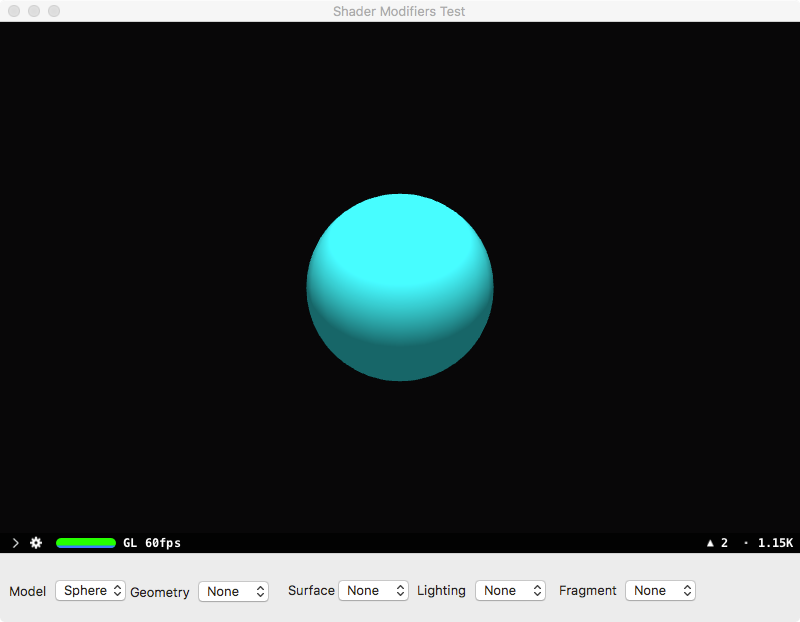

# SceneKit — OpenGL Shaders

This is the macOS port of Nathanael Beisiegel’s iOS utility named "sceneKit-glshaders".

https://github.com/pk-nb/scenekit-glshaders

The original source code has been refactored to Swift 3.x. and I have added a macOS UI to the project code.

The code has been modified so that it could be compiled without errors for an iOS as well as a macOS target.

Note: the Rendering API for the SceneKit View object for the macOS port is set to OpenGL.

On launching the macOS application, the following screen will be displayed on the desktop.

This project could be modified to test Scenekit-Metal shader snippets instead of GL shader snippets. Just a minor change to the "renderingAPI" property of the SceneKit View object.

**Requirements:**

XCode 8.x running under macOS Sierra (10.12.x).

